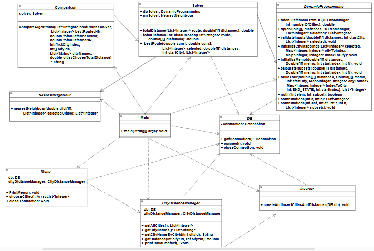

# Project Structure

This section provides an overview of the structural organization of the project. It begins by outlining the useful tools utilized in the project's backend infrastructure, followed by an analysis of the organization within both folders and packages. Furthermore, it presents a visual representation of the project's structure through a UML diagram. Each subsection offers valuable insights into the project's architecture and serves as a comprehensive guide, especially for those who want to contribute.


## Overview 
- [Useful Tools](#useful-tools)
- [Visualization of the Structure](#visualization-of-the-structure)
- [Packages](#packages)
- [UML](#uml)
- [Data Structures and Algorithms](#data-structures-and-algorithms)
- [Dependencies](#dependencies)

## 🔧Useful Tools
Routegenie leverages a set of powerful tools to ensure an efficient planning process. These tools contribute to the project's functionality, user interface, database management, and overall performance.

* **Apache Maven**\
Our project  is built and managed using Apache Maven, a powerful build and project management tool. Maven streamlines the build process, manages dependencies, and ensures a consistent and reliable build for the project.

* **JavaFX and SceneBuilder**\
The graphical user interface (GUI) of Routegenie is developed using JavaFX, a framework for building interactive applications. Scene Builder, a visual layout tool, is also integrated to enhance the design and layout of Mobi's user interface.

* **SQLITE Database (Embedded)**\
Mobi relies on the embedded form of the sqlite Database, offering a lightweight and efficient solution for managing project databases. This choice ensures data handling within the application while maintaining a compact and easily deployable database system.

## Visualization of the Structure
Visually, the structure follows this plan: 

```
C:.
├───.vscode
├───docs
├───Main
│   └───.idea
└───routegenie
    ├───.vscode
    ├───src
    │   ├───main
    │   │   └───java
    │   │       └───gr
    │   │           └───aueb
    │   │               └───dmst
    │   │                   └───NinJavas
    │   │                       ├───Algorithms
    │   │                       ├───Controller
    │   │                       ├───Core
    │   │                       ├───Data
    │   │                       └───GUI
    │   └───test
    │       └───java
    └───target
        ├───classes
        │   └───gr
        │       └───aueb
        │           └───dmst
        │               └───NinJavas
        │                   ├───Algorithms
        │                   ├───Controller
        │                   ├───Core
        │                   ├───Data
        │                   └───GUI
        └───test-classes

```

#### 📄Files

* **pom.xml**\
The pom.xml file is a configuration file used in Maven projects. It contains project information, dependencies and build settings.

* **README.md**\
The README.md file provides an overview of the project. It contains essential information such as project description, installation instructions, and usage guidelines.

#### 📂Folders


* **src**\
  The src directory contains the main source code and test files for the application. Specifically, it contains the subfolders:

  * **main**\
    The main directory includes the `java/gr/aueb/dmst/NinJavas` directories.

    * **java/gr/aueb/dmst/NinJavas**\
      The `java/gr/aueb/dmst/NinJavas` directory contains the Java source code files for the application, which are further explained in detail in the next section of [Packages](#packages).

  * **tests/java**\
    The tests/java directory is dedicated to unit testing using [JUnit 5](https://github.com/junit-team/junit5?tab=readme-ov-file). Within this section, you'll find Java test files, each named after the original classes, located in the **java/gr/aueb/dmst/NinJavas** folder, but suffixed with "Test". This naming convention indicates their purpose and association with the classes they test.

## 📦Packages
The source code of Mobi is located within the path: **src/main/java/gr/aueb/dmst/NinJavas**. The package `gr.aueb.dmst.NinJavas` represents the main package structure of the project, reflecting a carefully crafted organization aimed at ensuring modularity, reusability, and maintainability. Within this structure, distinct sections categorize the codebase based on functionality and purpose. Particularly:

* `Core`\
The `core` package serves as the home for superclasses that establish a common foundation in the project. These superclasses are inherited by classes used in both the `gui` and `cli` packages, promoting a consistent set of functionalities across different facets of the project.<br><br>


* `GUI`\
The `gui` package hosts classes dedicated to the _graphical user interface (GUI)_ functionalities of Routgenie. These classes provide a visual and interactive experience for users, allowing them to choose cities efficiently. Hence, they are denoted by the suffix **GUI** in their names.

* `data`\
The `data` package manages classes that are designed to orchestrate essential operations on the databases of our project.
These classes encapsulate data access logic, ensuring a robust and reliable interaction with the underlying data storage. Hence, they are denoted by the prefix **Data** in their names.

* `Algorithms`\
The `Algorithms` package houses our 2 TSP solving algorithms which our application runs for better and more efficient results, as well as the class that compares their results and delivers the user the best route for their trip.

This organizational approach not only enhances code maintainability but also facilitates ease of navigation for developers contributing to different aspects of the project. The clear separation of concerns among packages ensures a modular and extensible design, promoting a scalable and efficient development process.

## 🔍UML
To visualize the structure of our project, including inheritence, implementation and dependency relationships between classes, check out the following UML diagram.
Note that classes used in the CLI version of Mobi are colored blue and classes used in the GUI version are colored green. 




## Data Structures and Algorithms

### Data Structures
Throughout the development of our project, we leveraged data structures that seemed to be pivotal in both the command-line interface (CLI) and graphical user interface (GUI) versions, facilitating diverse functionalities and operations. Specifically: 
* **HashMap**: 

Mapping cities to their respective indices for efficient processing.

* **ArrayLists**: of String and Integer

The ArrayList of Integer and String made the storage and update of the lists of cities and city names easier.

### Algorithms
Our application is based on the usage of two separate algorithms which both addresses the Travelling Salesperson Problem. 

* The nearest neighbor algorithm starts from the starting point and finds the shortest distance to the remaining options. From there, it moves to the next location, finding the next closest city based on the distances from the current city, comparing it with the remaining ones. In short, it identifies the next closest city from the one it is currently located in.

* The Dynamic Programming algorithm solves the Traveling Salesperson Problem (TSP) by finding the optimal route with the minimum distance among a series of cities, ensuring the route returns to the starting city. Key components include validating inputs, using a HashMap to map cities to indices, and employing a memoization table with bitmasking to store optimal solutions for each state or subset of cities. The buildTour method is used to reconstruct the optimal route from the memoization data, ultimately providing the best path as a list.

## Dependencies

The table below contains all the dependencies used, for the development of Routegenie.

| Libraries                                               | Versions    |
|---------------------------------------------------------|-------------|
| org.junit.jupiter:junit-jupiter-api                     |    5.10.1   |
| org.openjfx:javafx-controls                             |    21.0.2   |
| org.openjfx:javafx-fxml                                 |    21.0.2   |
| org.xerial:sqlite-jdbc.                                 |    3.47.1.0 |